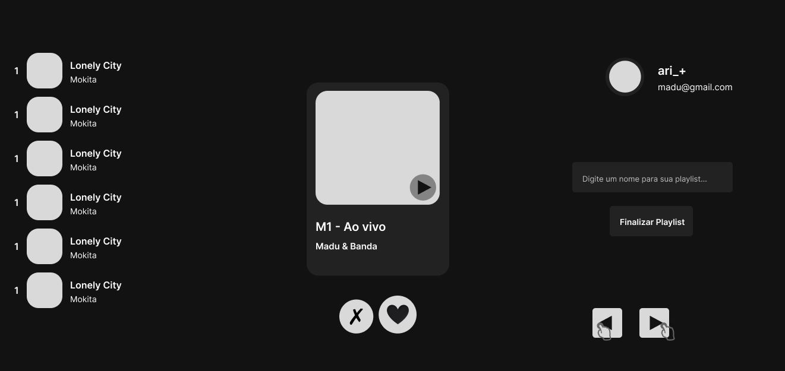
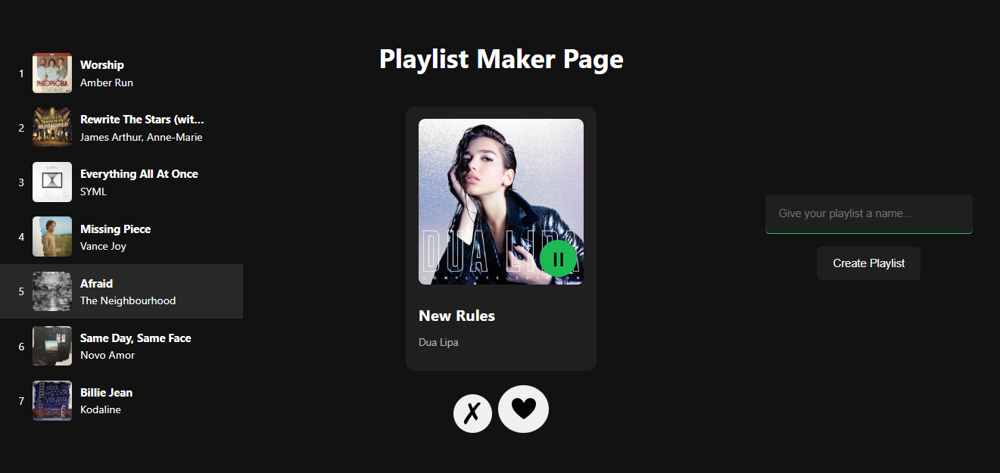

# Playlist Maker

  <figure>
    
    <figcaption>Reference on Figma</figcaption>
  </figure>
  <figure>
    
    <figcaption>Current situation</figcaption>
  </figure>

Project in progress, already working:
- Authorization through Spotify
- Searching tracks to suggest
- Rejecting or choosing suggested tracks to playlist
- Displaying currently situation of playlist on creation
- Adding a name and actually creating the playlist on the Spotify account